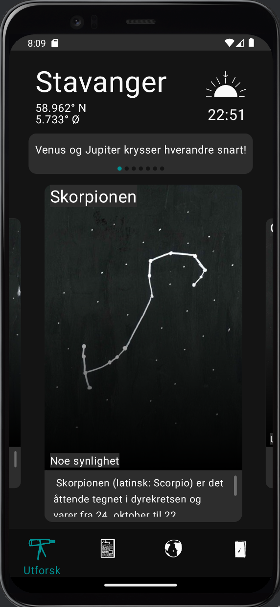
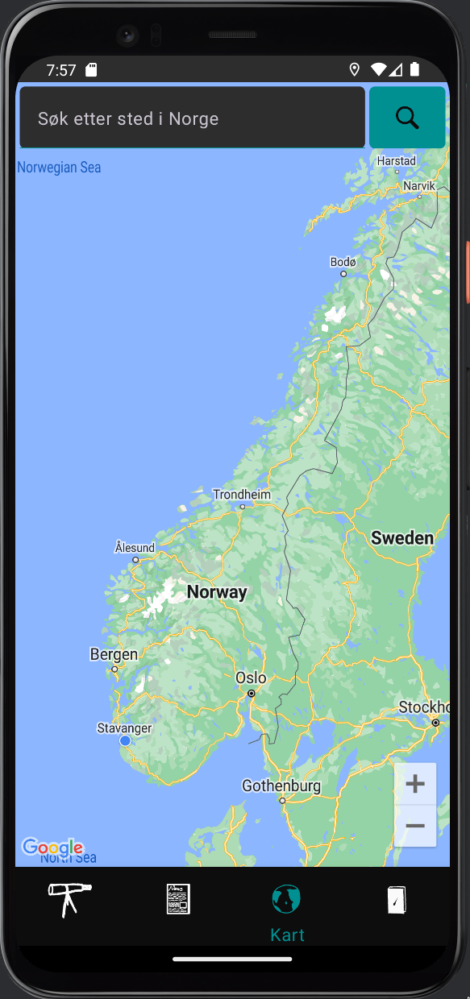
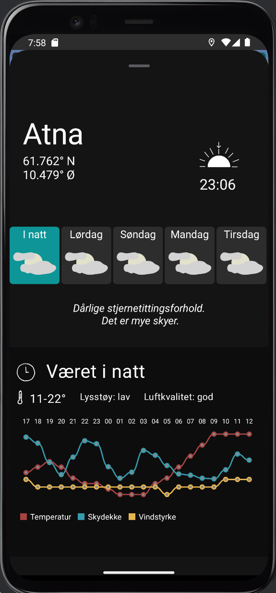
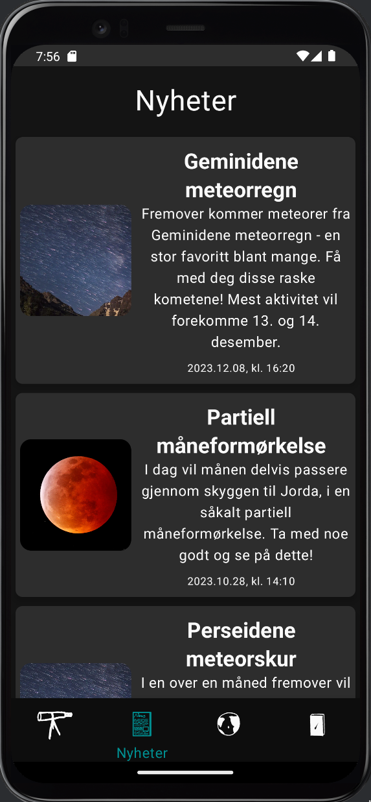
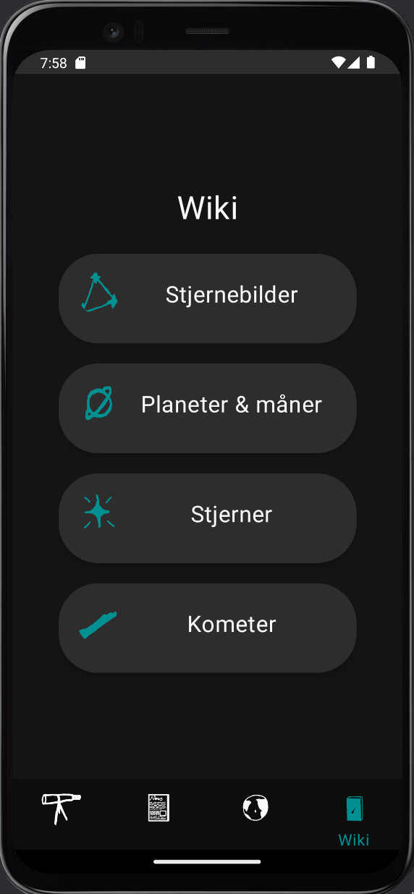
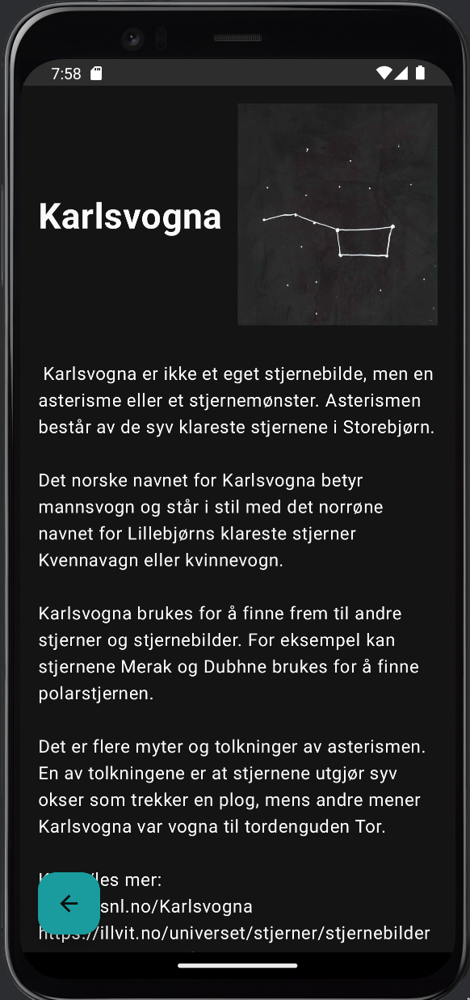

<h1>Nattklar</h1>

This is a mirror of the <b><i>Nattklar</i></b> project developed by a team of students at UiO for the course IN2000. Repository used under development is privately stored on UiO's enterprise GitHub. <a href="https://developers.google.com/maps/documentation/android-sdk/get-api-key">To run the app you will need a google maps API key</a>. You then need to provide this API key inside two files: `/project/app/src/main/AndroidManifest.xml` and `/project/app/src/main/java/com/example/nattklar/model/dataprocessing/GoogleMaps.kt`

The app is a stargazing that allows users to see the conditions for how visible constellations for the upcoming nights. The app gets this information by querying MET APIs with parameters from the users location given they give permissions. Otherwise you can manually search for locations in the globescreen. The app also has other functionality such as largely personally written information about common astronomical objects and seeing upcoming and previous astronomical news

<h2>Homescreen:</h2>

    

    
This screen shows a summary of the most relevant data for stargazing. If you have given the app location permissions this will show your location, the time for tonights sunset for your location, a list of upcoming astronomical events and a list of constellations with a grading of each constellation's visibility and a short description.
    
It was developed mostly by Adam, Herman and Per Ellef.

<h2>Globescreen:</h2>

    
    

    
If you have given the app location permissions, upon opening the globescreen you will be presented with detailed descriptions for the night viewing conditions for the upcoming nights. This includes your location, the time of the next sunset for your location, a list of upcoming nights you can see night viewing conditions for, a summary of the night viewing conditions, and a detailed graph showing relevant data for stargazing for the selected night (temperature, cloud coverage and wind speed).
    
It was developed mostly by Herman and Per Ellef.

<h2>Newsscreen:</h2>

    

    
This screen shows upcoming and previouos astronomical events.

    
It was developed mostly by Filip and Dawid.

<h2>Wikiscreen:</h2>

    
    

    
This screen shows information about astronomical objects such as constellations, individual stars, planets & moons and comets. Each constellation has a personally written description and the other objects' descriptions are taken from snl.

    
This screen was developed mostly by Adam and Henriette.

Navigation was largely done by Dawid and Adam and parsing the user's location and general theming of the app was largely done by Herman.

<h2>Team members:</h2>
<ul>
    <li><a href="https://github.com/gremble0">Herman</a></li>
    <li><a href="https://github.com/Filip-Rasmussen">Filip</a></li>
    <li><a href="https://github.com/Adam-Karl">Adam</a></li>
    <li><a href="https://github.com/perellef">Per Ellef</a></li>
    <li>Dawid</li>
    <li>Henriette</li>
</ul>
